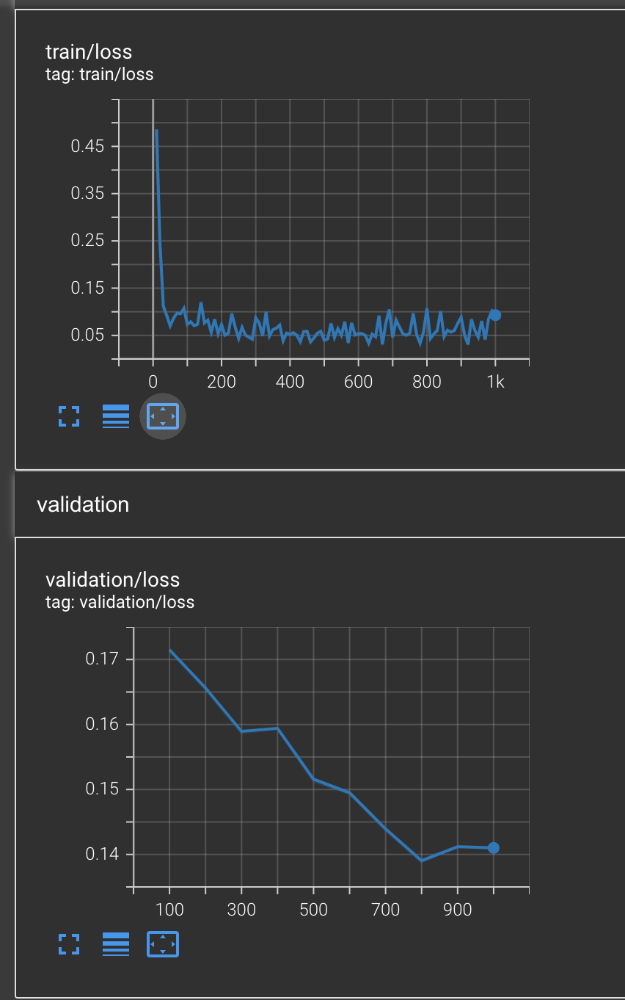

# Classification task

## First implementation (18/09/2022)

- Simple dataset:

  - Using tracking ground-truth, make a track-history of sperm
  - From the history -> calculate the average speed, the moving distance, and the vector distance (**_vector distance is distance better the first and the last known position_**)
  - For each video (or, **_patient_**), extract the above information for each sperm -> aggregate with average
  - Getting 4 features for each video: num. of sperm, avg. speed, avg. distance, avg. vector-distance
  - Label: percent of progressive, non-progressive, immotile. The total of 3 is = 1.

- Simple model:

  - 2 Dense layers of (4, 4) and (4, 3)
  - Softmax the output.

- Results:
  - Using L1 as loss, epoch as 1000, train-test-split = (60-40) => loss = 0.15

